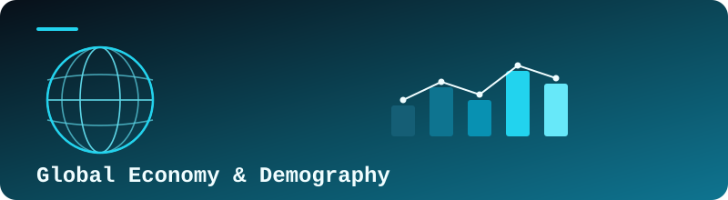
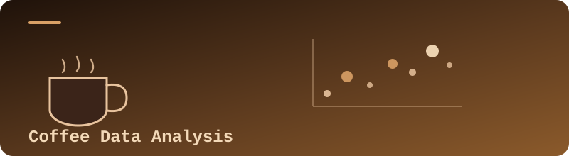
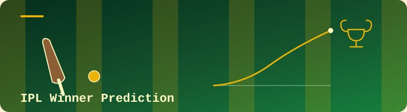

<div align="center">


<br>


<br><br>


</div>


<div align="center">

# 👋 Hi, I'm Parthasarathi A

### Data Science & Analytics Professional | Technical Trainer

**Python • SQL • Power BI • Excel • Statistics • Machine Learning**

</div>


## 🚀 About Me

<div align="center">

</div>

I am a **Data Science & Analytics Professional and Technical Trainer** focused on transforming data into meaningful insights, analytical solutions, dashboards, and machine learning models.

I work with **real-world datasets and practical projects** across Python, SQL, Power BI, Excel, Statistics, Exploratory Data Analysis, Data Visualization, and Machine Learning.

My approach combines:

```text
Technical Knowledge
        +
Practical Implementation
        +
Real-World Projects
        +
Problem Solving
        ↓
Meaningful Data Solutions
```

**Data → Cleaning → Analysis → Visualization → Modelling → Insights → Decision**


## 🧭 My Data Journey

<div align="center">

</div>

```text
                    BUSINESS PROBLEM
                           │
                           ▼
                    DATA COLLECTION
                           │
                           ▼
                     DATA CLEANING
                           │
                           ▼
              EXPLORATORY DATA ANALYSIS
                           │
                           ▼
                  DATA VISUALIZATION
                           │
                           ▼
                 STATISTICAL ANALYSIS
                           │
              ┌────────────┴────────────┐
              │                         │
              ▼                         ▼
          POWER BI              MACHINE LEARNING
              │                         │
              └────────────┬────────────┘
                           ▼
                        INSIGHTS
                           │
                           ▼
                  BUSINESS DECISION
```


## 🛠️ Technical Skills

### 🐍 Python & Data Science

<div align="center">

     

<br><br>


</div>

**Python Capabilities**
- Data manipulation with Pandas
- Numerical computing with NumPy
- Data visualization with Matplotlib
- Statistical visualization with Seaborn
- Data cleaning and preprocessing
- Exploratory Data Analysis
- Feature engineering
- Machine learning workflows

### 🗄️ SQL & Database

<div align="center">

  

<br><br>


</div>

```text
SELECT / WHERE
       ↓
GROUP BY / HAVING
       ↓
JOINS
       ↓
SUBQUERIES
       ↓
CTEs
       ↓
WINDOW FUNCTIONS
       ↓
ANALYTICAL QUERIES
```

Joins • Aggregations • CTEs • Subqueries • Window Functions • Data Analysis

### 📊 Power BI & Business Intelligence

<div align="center">

  

<br><br>


</div>

**Power BI Skills**
- Data import and transformation
- Power Query
- Data cleaning
- Data modelling
- Relationships
- DAX
- Measures
- Calculated columns
- KPI development
- Interactive dashboards
- Business reporting
- Data storytelling

### 📗 Excel Analytics

<div align="center">


<br><br>


</div>

**Excel Skills**
- Pivot Tables
- Pivot Charts
- XLOOKUP
- VLOOKUP
- Power Query
- Data Cleaning
- Data Analysis
- Dashboard Development

### 📐 Statistics & EDA

<div align="center">

</div>

**Statistical Analysis**
- Descriptive Statistics
- Probability
- Normal Distribution
- Z-Score
- Confidence Intervals
- Skewness
- Kurtosis

**Exploratory Data Analysis**

```text
              EDA
               │
       ┌───────┼───────┐
       ▼       ▼       ▼
   Univariate Bivariate Multivariate
       │       │       │
       ▼       ▼       ▼
  Distribution Relationships Patterns
       │       │       │
       └───────┼───────┘
               ▼
            Insights
```

### 🤖 Machine Learning

<div align="center">

   

<br><br>


</div>

**Machine Learning Workflow**

```text
Problem Definition
       ↓
Data Collection
       ↓
EDA
       ↓
Data Preprocessing
       ↓
Feature Engineering
       ↓
Train / Test Split
       ↓
Model Building
       ↓
Model Evaluation
       ↓
Hyperparameter Tuning
       ↓
Final Model
```

**Models & Concepts**

Classification • Regression • Logistic Regression • KNN • SVM • Decision Tree • Random Forest • XGBoost • Cross Validation • Hyperparameter Tuning • Accuracy • Precision • Recall • F1 Score • ROC-AUC • Confusion Matrix


## 👨‍🏫 Technical Training

<div align="center">

</div>

Currently working as a Data Analytics & Data Science Technical Trainer.

**Training Focus**

```text
Python
├── Pandas
├── NumPy
├── Matplotlib
└── Seaborn

SQL
├── Joins
├── Aggregations
├── CTEs
└── Window Functions

Excel
├── Data Cleaning
├── Pivot Tables
├── Lookup Functions
└── Analytics

Power BI
├── Power Query
├── Data Modelling
├── DAX
└── Dashboard Development

Machine Learning
├── EDA
├── Preprocessing
├── Model Building
└── Evaluation
```


## 💼 Featured Projects

<div align="center">

</div>

### 📊 01 — Global Economy & Demography Analysis



**Technology:** SQL • Power BI • Excel

Analysed economic and demographic data to identify trends, relationships, patterns, and meaningful insights.

**Focus**
- Economic indicators
- Population analysis
- Country comparison
- Trend analysis
- Business intelligence
- Dashboard development

### ☕ 02 — Coffee Data Analysis



**Technology:** Python • Pandas • NumPy • Matplotlib • Seaborn

Performed exploratory data analysis to understand distributions, relationships, patterns, and trends.

**Focus**
- Data cleaning
- Univariate analysis
- Bivariate analysis
- Multivariate analysis
- Statistical visualization
- Data-driven insights

### 🏏 03 — IPL Winner Prediction



**Technology:** Python • Pandas • Scikit-learn • Machine Learning

Machine learning project focused on analysing IPL data and developing a predictive model.

**Focus**
- Data preprocessing
- Feature engineering
- Model training
- Model evaluation
- Prediction

### 💼 04 — Global Salary Survey Analysis


**Technology:** Excel • SQL • Data Analytics

Analysed salary survey data to identify patterns and trends across different categories.

**Focus**
- Data cleaning
- Salary analysis
- Category comparison
- Trend identification
- Analytical reporting

### 🛒 05 — Superstore Sales Analysis


**Technology:** Excel • Data Analytics

Analysed sales performance, revenue patterns, product performance, and business trends.

**Focus**
- Sales analysis
- Product performance
- Revenue trends
- Category analysis
- Business insights


## 🎯 Current Focus

<div align="center">


<br><br>

      

</div>


## 🧠 How I Approach Problems

<div align="center">

</div>


## 🐍 Contribution Snake

<div align="center">

</div>

> This snake is generated by a GitHub Action ([Platane/snk](https://github.com/Platane/snk)) that eats your contribution graph. Add the workflow to your `ParthasarathiAnalytics/ParthasarathiAnalytics` repo (Settings → Actions) so it builds the `output` branch automatically — the image above will start rendering once that workflow has run at least once.


## 🧩 My Professional Framework

<div align="center">


```text
       ┌──────────┐
       │   DATA   │
       └────┬─────┘
            ↓
     ┌──────────────┐
     │   INSIGHTS   │
     └──────┬───────┘
            ↓
      ┌───────────┐
      │  MODELS   │
      └─────┬─────┘
            ↓
      ┌───────────┐
      │  IMPACT   │
      └───────────┘
```

**Data → Insights → Models → Impact**

</div>


## 📚 Areas of Interest

<div align="center">


<br><br>

`Data Analytics` `Data Science` `Machine Learning` `Business Intelligence` `Data Visualization` `Python` `SQL` `Power BI` `Excel` `Statistics` `AI` `Automation`

</div>


## 🤝 Connect With Me

<div align="center">


<br><br>

<a href="https://www.linkedin.com/in/parthasarathi-a-2a429b273">

</a>
&nbsp;&nbsp;&nbsp;
<a href="https://github.com/ParthasarathiAnalytics">

</a>
&nbsp;&nbsp;&nbsp;
<a href="https://parthasarathia.lovable.app">

</a>

</div>

<div align="center">

<br>


<br><br>

**DATA → INSIGHTS → MODELS → IMPACT**

**Parthasarathi A**

</div>


